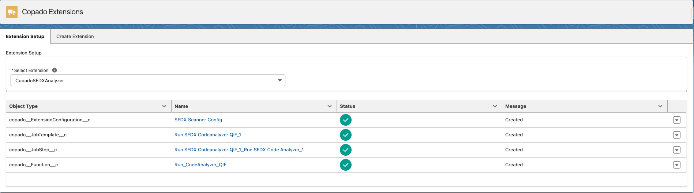
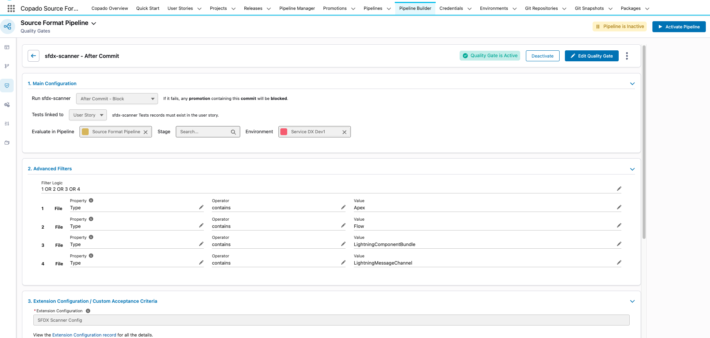

# Code Analyzer for Copado

With Salesforce Code Analyzer for Copado, you can use Code Analyzer as a **quality gate** in your Copado pipeline. The extension runs analysis only on **changed components**, ensuring efficient code quality and security scanning throughout your development process.

## Is this extension for you?
Are you a Copado customer? ✅\
Do you want to use the latest and greatest from Salesforce on quality and security scanning? ✅\
If the answer is yes, to both of these questions, then yes this is extension is for you.

What is Salesforce Code Analyzer?

[Salesforce Code Analyzer](https://developer.salesforce.com/docs/platform/salesforce-code-analyzer/guide/code-analyzer.html) is a unified static code analysis tool for checking the quality, security, and performance of Salesforce code. It supports multiple engines: `sfge`, `pmd`, `pmd-appexchange`, `flow scanner`, `cpd`, `eslint`, `retire-js`, and `regex`. The tool includes hundreds of customizable rules and is required for AppExchange security review. You can tailor its behavior and define custom rules using a YAML config file.

 

**⚠️ DISCLAIMER**

**Code Analyzer for Copado is NOT an officially supported tool**

👷 Use it at your own risk

Table of Contents

- [Getting Started](#-getting-started)
  - [Pre-Requisites](#pre-requisites)
  - [Installation](#installation)
  - [Post-Installation](#post-installation)
    - [Picklist Values](#picklist-values)
    - [Create Extension Records](#create-extension-records)
    - [Create the Quality Gate](#create-the-quality-gate)
    - [Configure Pipeline System Property (Optional, but recommended)](#configure-pipeline-system-property-optional-but-recommended)
    - [Customize other configuration (Optional)](#customize-other-configuration-optional)
- [Testing the setup](#testing-the-setup)
- [In-depth setup and walkthrough examples](#in-depth-setup-and-walkthrough-examples)
  - [Trigger Points](#trigger-points)
    - [After Commit](#after-commit)
    - [Before Deployment](#before-deployment)
    - [After Promotion](#after-promotion)
  - [Reviewing the scan results](#reviewing-the-scan-results)
    - [Engine and Rule Grouping](#engine-and-rule-grouping)
    - [Metadata Type and Filename Grouping](#metadata-type-and-filename-grouping)
    - [Severity Filters and Search](#severity-filters-and-search)
    - [Open up the Result record](#open-up-the-result-record)
- [v5 Release Notes](#v5-release-notes)
  - [🚀 New Features](#-new-features)
    - [Upgrade to Code Analyzer 5.3](#upgrade-to-code-analyzer-53)
    - [Enhanced Results Display](#enhanced-results-display)
  - [Migration Guide](#migration-guide)
    - [Delete DFA related metadata](#delete-dfa-related-metadata)

#  Getting Started

## Pre-Requisites
* Be a Copado CICD Customer on Copado Source Format Pipelines.
* Minimum Copado Deployer version = 25.0
* Minimum Copado Quality Tools version = 4.0

## Installation
- Install the [latest version of Copado SFDX Analyzer](https://success.copado.com/s/listing-detail?recordId=a545p000000Xx1hAAC) from Copado's DevOps Exchange.

- If you're upgrading for version 2.x to this latest version 5.x, then follow the [Migration Guide](#migration-guide), and after following it come back to the [Quality Gates section](#create-the-quality-gate).

## Post-Installation

### Picklist Values
Create the Following Picklist values
* Setup --> Object Manager --> Extension Configuration --> Field: Extension Tool --> Value: `sfdx-scanner`
* Setup --> Picklist Value Set --> Copado Test Tool --> Value: `sfdx-scanner`

### Create Extension Records
Navigate to the “Copado Extensions” tab from the App Launcher, select “CopadoSFDXAnalyzer” and press the button “Generate Extension Records”.

### Create the Quality Gate
* Navigate to Pipeline Builder.
* Go to the Quality Gates sub-section from the left-hand side pane.
* Click on `Create Quality Gate` button, and choose `sfdx-scanner` from the list.
* You can choose to create it `After Commit - Block`, `After Promotion - Report` or `Before Deployment - Block` depending on the behavior you need.
* You can configure the environment(s) and/or stage(s) the quality gate should be applied to.

  

* Here's an example of how you can create an after commit quality gate, running on `Service DX Dev 1` environment, with **Advanced filters** so that it is only triggered when at least one metadata item that matches the type **Apex** (`ApexClass`, `ApexTrigger`, `ApexComponent`, `ApexPage`), **LWC, Flow, Messaging Channel** has been committed, and thus only running it when required.
  

### Configure Pipeline System Property (Optional, but recommended)

* Go to Pipelines from the App Launcher --> open your pipeline --> Settings sub tab --> Click New on System Property --> Property Name and API Name: `sfdx_scanner_severityThreshold`.
* Valid severity values are: 1 (Critical), 2 (High), 3 (Moderate), 4 (Low), or 5 (Info).
* If this property is not set, or set incorrectly, then it'll default to severity 2 (High).
* The Quality gate will throw an error when violations are found with equal or greater severity than the provided value.
* Leave other values blank, and hit save.

### Customize other configuration (Optional)
Code Analyzer allows a lot of customization options such as turning engines on/off, adding custom rules, change severity of existing rules, to get started add `code-analyzer.yml` in the root of your project, like a sample is added [here](./code-analyzer.yml), and then the Quality Gate will automatically pick up your configuration. To learn about its complete setup, refer to the [customizing configuration documentation](https://developer.salesforce.com/docs/platform/salesforce-code-analyzer/guide/config-custom.html)

## Testing the setup
If you have set up the `After Commit` Quality Gate, like the example in the above configurations, then just perform a commit which contains ApexClass/LWC/ApexComponents/Flows/Messagning Channels on a user story. that is tied to the environment/stage in which your Quality Gate is set up, and the Commit Action will invoke the `Code Analyzer` after every commit.

Here's some [test-data](./test-data/) that can be used to test the Quality Gate, and a sample [configuration file](./code-analyzer.yml).

# In-depth setup and walkthrough examples

## Trigger Points
You can configure Code Analyzer to run at different stages of your deployment pipeline. The supported trigger points are:

### After Commit

<table>
<tr>
<td></td>
<td></td>
</tr>
</table>

Run Code Analyzer after every commit that happens on your User Stories. This allows you to shift left in your quality and security scanning journey, and if the latest commit on a User Story has failed due to violations, it won't be allowed to be promoted to the next environment.

### Before Deployment

Run Code Analyzer before deployment as a **quality gate**. This analyzes all User Stories in the deployment together. If violations are found, the deployment is blocked.

### After Promotion

Run Code Analyzer after promotion for **reporting purposes only**. This provides visibility into code quality across all User Stories in the deployment without blocking the process.

> **Key Difference**: While User Story analysis runs on individual user stories, deployment-level analysis evaluates the **collective impact** of all User Stories in the deployment, providing a comprehensive view of code quality across the entire Promotion.

## Reviewing the scan results

### Engine and Rule Grouping

There are two groupings for the results, the first one as seen in the image above is by **Engine/Rule**. This allows you to view the violations grouped by the Engine, and then by Rule. This is helpful to see just specific engine or rule errors.

### Metadata Type and Filename Grouping

You can also switch to the **Type/Filename** grouping from the drop down, this is better if you just want to focus on specific metadata types, or look into all errors in a single file.

### Severity Filters and Search

You can use the different severity filters and search box to narrow down the results.

### Open up the Result record

The Result record can be further opened to increase the screen real estate making reading the violations better, as well as use the different severity filters, search and groupings.

# v5 Release Notes

## 🚀 New Features

### Upgrade to Code Analyzer 5.3
- **New Engines**: Regex, Flow are the new engines that are supported. [See all supported engines](https://developer.salesforce.com/docs/platform/salesforce-code-analyzer/guide/engines.html)
- **SFGE**: Can be run with a single quality gate, no need to create another Quality Gate to run Data Flow Analysis.
- **Custom Config File** - v5 introduces a configuration YAML file (code-analyzer.yml) which you can use to configure top-level properties and customize rules and engines, including adding custom rules. [See Customize the v5 Configuration for details.](https://developer.salesforce.com/docs/platform/salesforce-code-analyzer/guide/config-custom.html)

### Enhanced Results Display
- **Clean, Modern Interface**: Results are displayed in an organized, easy-to-read format within the Result Modal
- **Smart Organization**: Results are automatically grouped and organized for easy navigation
- **Quick Search**: Find specific violations instantly by typing in the search box - searches across files, rules, messages, engines.
- **Severity Filtering**: Click on colored buttons to filter by severity level (Critical, High, Moderate, Low, Info)
- **Dynamic Counts**: See real-time counts of violations that update as you filter
- **One-Click Reset**: Clear all filters with a single button click
- **Group by Engine**: View results organized by analysis tool (PMD, ESLint, etc.) with rule breakdowns
- **Group by File Type**: View results organized by metadata type (Apex classes, LWC components, etc.) and file name breakdown.
- **Collapsible Sections**: Expand and collapse sections to focus on what matters most
- **Detailed Information**: See file paths, line numbers, violation messages, and rule documentation links.

## Migration Guide
- If you're upgrading from 2.x of Code Analyzer to version to 5.x version, then there are certain changes you'll need to do.

- The new 5.x version relies on some new capabalities by the Copado Deployer and Quality tools package, hence minimum requirements have changed. Please upgrade those packages to the required version as listed in the [Pre-requisites](#pre-requisites) section.

- After upgrading, navigate to the “Copado Extensions” tab, select “CopadoSFDXAnalyzer” and press the button “Generate Extension Records”.

- After Generating the new records, go to "Functions > Run SFDX Code Analyzer QIF > Configuration sub-tab", and if the Callback Type is set to Apex, set it to 'None'.

- You likely are using the legacy Quality Gate Rules. Delete the older Quality Gate Rules, and Quality Gate Rule Conditions by going to the Quality Gates tab, and searching for the SFDX Scanner Quality Gates you had created. There should likely be *two*, one for DFA, and one for other engines. So repeat this step for the other Quality Gate Rule as well.

  

### Delete DFA related metadata
DFA analysis using the `SFGE` engine, is now part of the main quality gate, hence we need to delete the older references.
- Go to App Launcher --> Functions -->  Run SFDX Code Analyzer DFA QIF --> Delete.

- Go to App Launcher --> Job Templates --> Run SFDX Codeanalyzer DFA QIF --> Switch to steps sub tab --> Delete all the steps one by one --> Finally delete the Job Template.

- Go to App Launcher --> Extension Configuration --> SFDX Scanner Config DFA --> Deactivate --> Delete

- Go to setup --> Picklist Value Sets --> Copado Test Tool --> Delete `sfdx-scanner-dfa` value --> Replace with blank.

- Go to setup --> Object Manager --> Extension Configuration --> Field: Extension Tool --> Delete `sfdx-scanner-dfa` value --> Replace with blank.

- Once all of this is deleted, go back to create [new Quality Gates](#create-the-quality-gate) section and continue.

